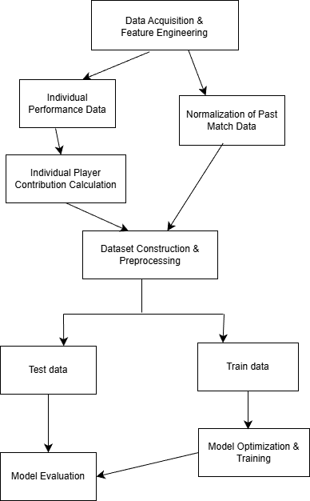

# EPL-Match-Predictor-ML
EPL Match Prediction Model based on Player Contribution Metrics using MLP Neural Network
*Note: This repository has been migrated from a private development environment to serve as the primary, public-facing version of the project.*

## Premier League Match Prediction via Individual Player Contributions
Quantifying Performance with MLP-based Neural Networks

Project Overview: This project introduces a novel approach to football match prediction by shifting focus from team-level statistics to individual player contributions. By quantifying players into AC (Attack), DC (Defense), and MI (Match Influence) metrics, we aim to capture the dynamic impact of lineups on match outcomes.

## Key Achievements & Insights
Novel Feature Engineering: Developed a proprietary algorithm to quantify player-specific impact, moving beyond traditional aggregate team data.

Exploratory Research: While the current accuracy (57.4%) reflects the inherent volatility of football, this project serves as a proof-of-concept for a bottom-up predictive framework rather than a top-down statistical model.

Feature Importance Analysis: Identified that home_forward_contrib (Attack Contribution of home forwards) is the most statistically significant variable, providing valuable insights into the "Home Advantage" phenomenon.

## Contributors
### [Jiheon Kim]

Role: Lead Researcher / First Author
Contribution: Designed the research framework and developed the core algorithms for AC, DC, and MI metrics.

### [Hyunseong Jeon]

Role: Lead Developer / Repository Owner

Contribution: Architected and implemented the entire Python codebase. Engineered the data preprocessing pipeline, built the MLP/Random Forest/GBM models, and conducted comprehensive performance benchmarking.

HyeonGue Kim, Youngju Im, Euichan Jeong

Role: Research Assistants

Contribution: Supported raw data acquisition from FootyStats and performed initial data validation.

## Tech Stack
Language: Python

ML Libraries: Scikit-learn (MLPClassifier, RandomForestClassifier, GradientBoostingClassifier)

Data Handling: Pandas, NumPy

Environment: Google Colab / Local Python environment

## Methodology & Pipeline
The project follows a rigorous data science pipeline, ensuring high-quality feature extraction from complex match datasets.

  

## License & Data Permission
Official Data Access: All match and player statistics were sourced from FootyStats with official permission obtained via email for research purposes.

Ethical Standards: This repository is for academic and portfolio use only. Redistribution of the raw dataset is strictly prohibited to respect data provider rights.

## Future Work
Integrating real-time injury data and transfer market values to enhance the MI (Match Influence) metric.

Experimenting with RNN/LSTM architectures to capture the temporal form of players over a season.
